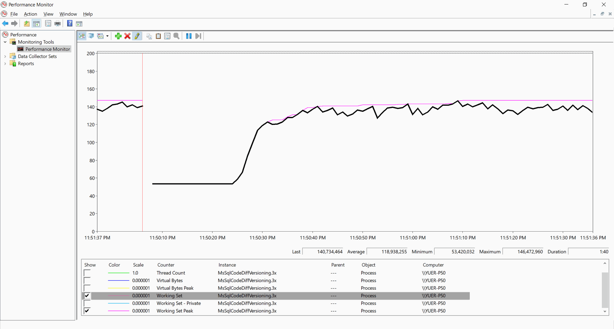
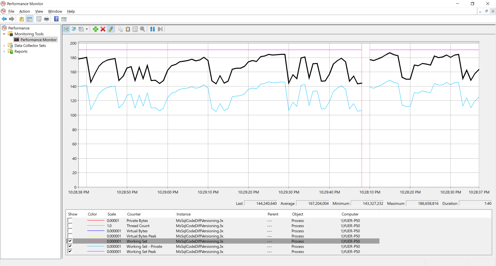

# Microshaoft.Common.Utilities.Net

At least since 2016-10-24

License:
Microshaoft.Common.Utilities.Net (including the repo) is licensed under the MIT license.

Contact:

  Microshaoft@gmail.com

  Microshaoft@msn.com
  
  Microshaoft@qq.com

|	DevOps Platform 	|	CI/CD Status (Build Only)	                                                                                                                                                                                                                                        |
| ----:	| ----	|
|	Azure Pipelines:	| 	                    |
|	GitHub Actions:		| 				|
|	AppVeyor:			| 																							    |
|	Travis-CI:			| 																							|

Test Urls:

http://localhost:5000/

http://localhost:5000/DataTable.html

http://localhost:5000/api/perfmon/ExecutingCachingStore

http://localhost:5000/api/perfmon/RequestResponseLoggingProcessor

http://localhost:5000/api/perfmon/Runtime

http://localhost:5000/api/perfmon/RequestResponseLoggingStats

Too Simple Performance Test (non-concurrency):

Memory Usage on Windows:

2020-01-31 23:

2020-02-02 02:

Web IO Results:

https://github.com/Microshaoft/Microshaoft.Common.Utilities.Net/blob/netcoreapp3.1.101/Samples/MsSqlCodeDiffVersioning/MsSqlCodeDiffVersioning.Shared/00.PerfTest/10.Results/PerfTest.Web.IO.xlsx

.NET Today/Now and Tomorrow/Future

https://github.com/dotnet-presentations/dotnetconf2019/blob/master/Technical/dotNETConf2019_Keynote.pptx

.NET Schedule

