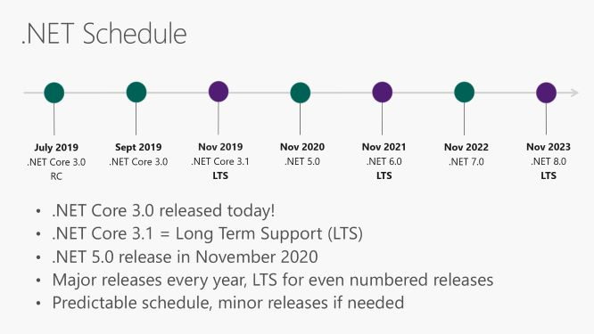

# Microshaoft.Common.Utilities.Net.4x

At least since 2016-10-24

License:
Microshaoft.Common.Utilities.Net (including the repo) is licensed under the MIT license.

Contact:

  Microshaoft@gmail.com

  Microshaoft@msn.com
  
  Microshaoft@qq.com

|	DevOps Platform 	|	CI/CD Status (Build Only)	|
| ----:	| ----	|
|	Azure Pipelines:	| [](https://microshaoft.visualstudio.com/Microshaoft.Common.Utilities.Net-GitHub/_build)	|
|	GitHub Actions:		| [](https://actions-badge.atrox.dev/Microshaoft/Microshaoft.Common.Utilities.Net/goto)												|
|	AppVeyor:			| [](https://ci.appveyor.com/project/Microshaoft/microshaoft-common-utilities-net)																																	                            |
|	Travis-CI:			| [](https://travis-ci.org/Microshaoft/Microshaoft.Common.Utilities.Net)																																						|


.NET Today/Now and Tomorrow/Future

https://github.com/dotnet-presentations/dotnetconf2019/blob/master/Technical/dotNETConf2019_Keynote.pptx

.NET Schedule



```
//rem only for Windows/dos cmd
xcopy ..\..\StoreProcedureWebApiExecutorsPlugins\MsSQL.StoreProcedureWebApiExecutor.Plugin\bin\Debug\netcoreapp2.2\*plugin* $(TargetDir)CompositionPlugins\ /Y
xcopy ..\..\StoreProcedureWebApiExecutorsPlugins\MySQL.StoreProcedureWebApiExecutor.Plugin\bin\Debug\netcoreapp2.2\*plugin* $(TargetDir)CompositionPlugins\ /Y
xcopy ..\..\JTokenModelParameterValidatorsPlugins\JTokenModelParameterValidatorSamplePlugin\bin\Debug\netcoreapp2.2\*plugin* $(TargetDir)CompositionPlugins\ /Y

xcopy ..\..\StoreProcedureWebApiExecutorsPlugins\MySQL.StoreProcedureWebApiExecutor.Plugin\bin\Debug\netcoreapp2.2\*mysql.data* $(TargetDir)CompositionPlugins\ /Y
xcopy ..\..\StoreProcedureWebApiExecutorsPlugins\MySQL.StoreProcedureWebApiExecutor.Plugin\bin\Debug\netcoreapp2.2\*npgsql* $(TargetDir)CompositionPlugins\ /Y
xcopy ..\..\StoreProcedureWebApiExecutorsPlugins\MySQL.StoreProcedureWebApiExecutor.Plugin\bin\Debug\netcoreapp2.2\*sqlite* $(TargetDir)CompositionPlugins\ /Y
xcopy ..\..\StoreProcedureWebApiExecutorsPlugins\MySQL.StoreProcedureWebApiExecutor.Plugin\bin\Debug\netcoreapp2.2\*oracle* $(TargetDir)CompositionPlugins\ /Y
xcopy ..\..\StoreProcedureWebApiExecutorsPlugins\MySQL.StoreProcedureWebApiExecutor.Plugin\bin\Debug\netcoreapp2.2\*db2* $(TargetDir)CompositionPlugins\ /Y

xcopy ..\..\StoreProcedureWebApiExecutorsPlugins\MySQL.StoreProcedureWebApiExecutor.Plugin\bin\Debug\netcoreapp2.2\*mysql.data* $(TargetDir) /Y
xcopy ..\..\StoreProcedureWebApiExecutorsPlugins\MySQL.StoreProcedureWebApiExecutor.Plugin\bin\Debug\netcoreapp2.2\*npgsql* $(TargetDir) /Y
xcopy ..\..\StoreProcedureWebApiExecutorsPlugins\MySQL.StoreProcedureWebApiExecutor.Plugin\bin\Debug\netcoreapp2.2\*sqlite* $(TargetDir) /Y
xcopy ..\..\StoreProcedureWebApiExecutorsPlugins\MySQL.StoreProcedureWebApiExecutor.Plugin\bin\Debug\netcoreapp2.2\*oracle* $(TargetDir) /Y
xcopy ..\..\StoreProcedureWebApiExecutorsPlugins\MySQL.StoreProcedureWebApiExecutor.Plugin\bin\Debug\netcoreapp2.2\*db2* $(TargetDir) /Y

```
